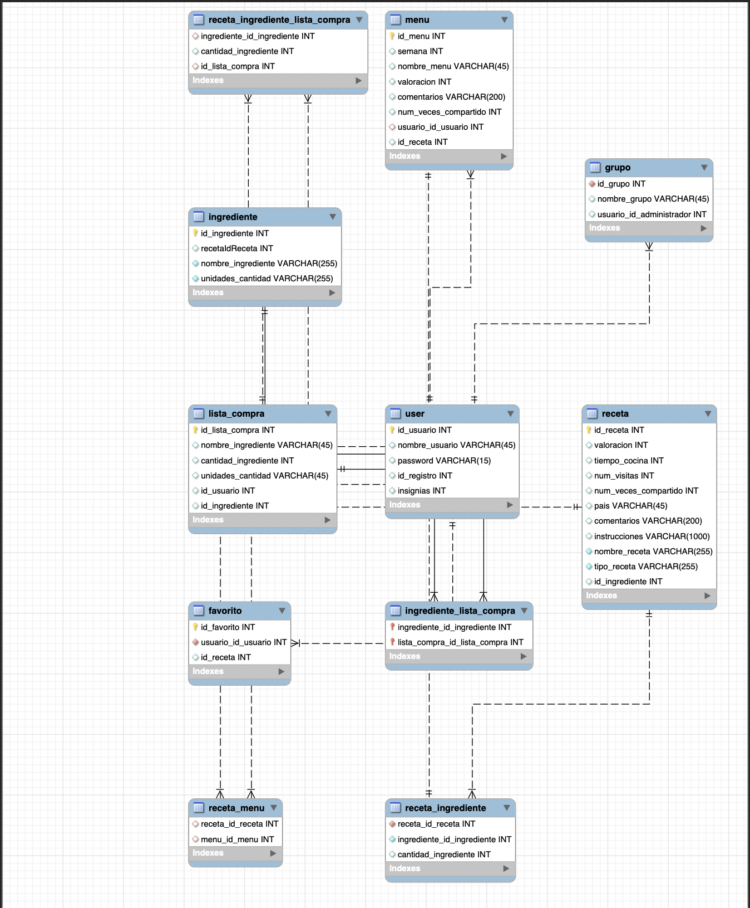
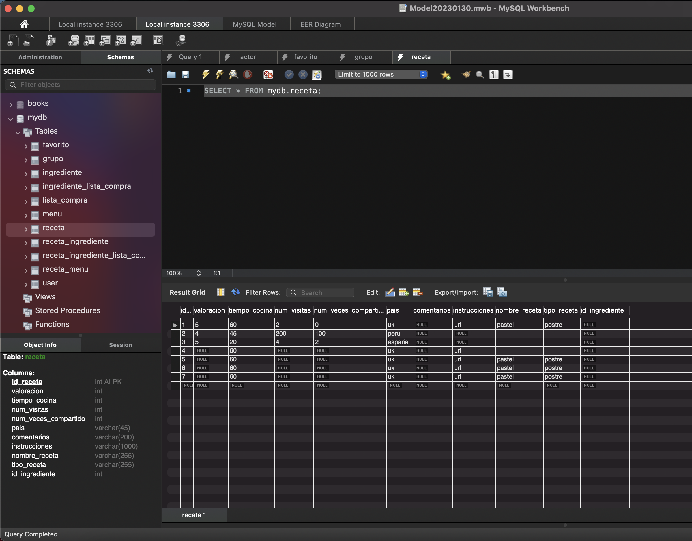

# 👩🍳 LAS COCINERAS

## TRELLO

Enlace a nuestro espacio Trello que muestra cómo organizamos el trabajo de este proyecto.



## BACKEND RECETTE SOCIAL DATABASE&#x20;

Diagrama y Dump de nuestra bada de datos mydb en MySQL.

### **DIAGRAM**

Imagen de nuestro diagrama de tablas y sus relaciones en MySQL.

### **DUMP**

**Imagen del dump de nuestra base de datos en MySQL.**

****

## ENDPOINTS

<mark style="color:purple;">**GET**</mark> <mark style="color:purple;"></mark><mark style="color:purple;"></mark>      **** [**http://localhost:3000/la-recette/receta**](http://localhost:3000/la-recette/receta)       **T**_**o get all recipes.**_

_****_

<mark style="color:purple;">**GET**</mark>**         **        [**http://localhost:3000/la-recette/receta/1**](http://localhost:3000/la-recette/receta/1)  **       **_**To get one recipe.**_

_****_

<mark style="color:green;">**POST**</mark>**      **      [**http://localhost:3000/la-recette/receta**](http://localhost:3000/la-recette/receta)   **           **_**To post one recipe.**_

_****_

<mark style="color:yellow;">**PUT**</mark> <mark style="color:yellow;"></mark><mark style="color:yellow;"></mark>      **** [**http://localhost:3000/la-recette/receta/1**](http://localhost:3000/la-recette/receta/1)    **        **_**To update one recipe.**_

_****_

<mark style="color:red;">**DEL**</mark>      **** [**http://localhost:3000/la-recette/receta/1**](http://localhost:3000/la-recette/receta/1)        **        **_**To delete a recipe.**_

_****_

<mark style="color:purple;">**GET**</mark>**        **        [**http://localhost:3000/la-recette/ingrediente**](http://localhost:3000/la-recette/ingrediente)       **       **_**To get all ingredients.**_

_****_

<mark style="color:green;">**POST**</mark>**     **     [**http://localhost:3000/la-recette/ingrediente**](http://localhost:3000/la-recette/ingrediente)       **       **_**To post one ingredient.**_

_****_

<mark style="color:purple;">**GET**</mark>**        **       [**http://localhost:3000/la-recette/users**](http://localhost:3000/la-recette/users)              **              **_**To get all users.**_

_****_

<mark style="color:green;">**POST**</mark>**     **     [**http://localhost:3000/la-recette/users**](http://localhost:3000/la-recette/users)           **           **_**To create one user.**_

_****_

<mark style="color:green;">**POST**</mark>**     **    [**http://localhost:3000/la-recette/auth/login**](http://localhost:3000/la-recette/auth/login)            **            **_**To get the authentication with login.**_

_****_

<mark style="color:green;">**POST**</mark>**     **     [**http://localhost:3000/la-recette/lista-compra/1**](http://localhost:3000/la-recette/lista-compra/1)       **       **_**To post the lista-compra.**_

_****_

<mark style="color:purple;">**GET**</mark>**       **       [**http://localhost:3000/la-recette/lista-compra**](http://localhost:3000/la-recette/lista-compra)     **              **_**To get lista-compra.**_

_****_

<mark style="color:purple;">**GET**</mark>**       **      [**http://localhost:3000/la-recette/lista-compra/1**](http://localhost:3000/la-recette/lista-compra/1)   **           **_**To get one user's lista-compra.**_

_****_

#### SWAGGER

.png>)

_****_

_****_

_****_

## PRESENTACIÓN

#### CANVA



